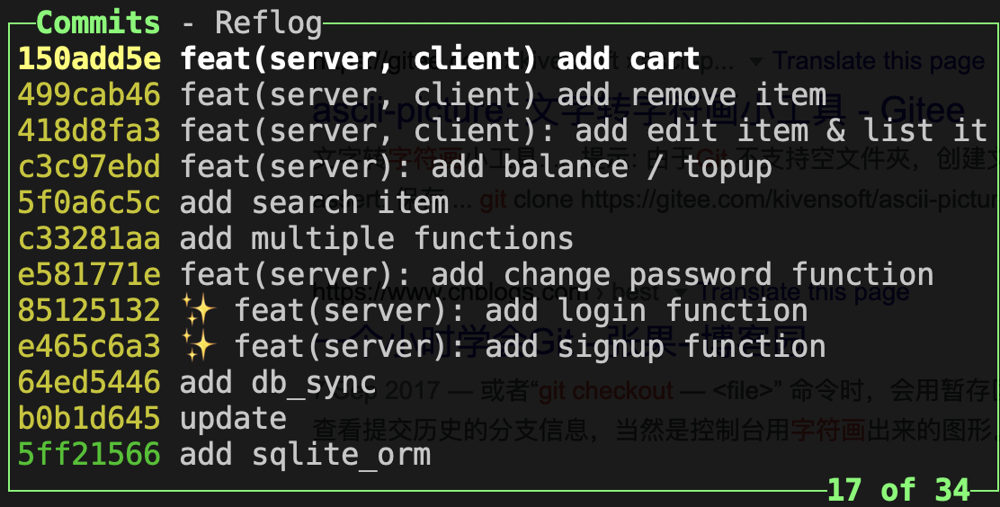
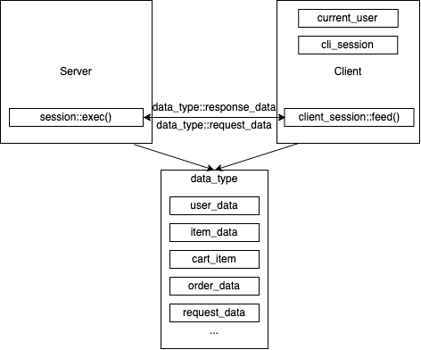
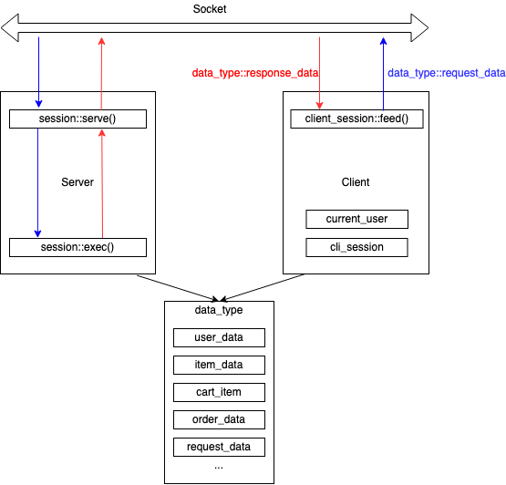
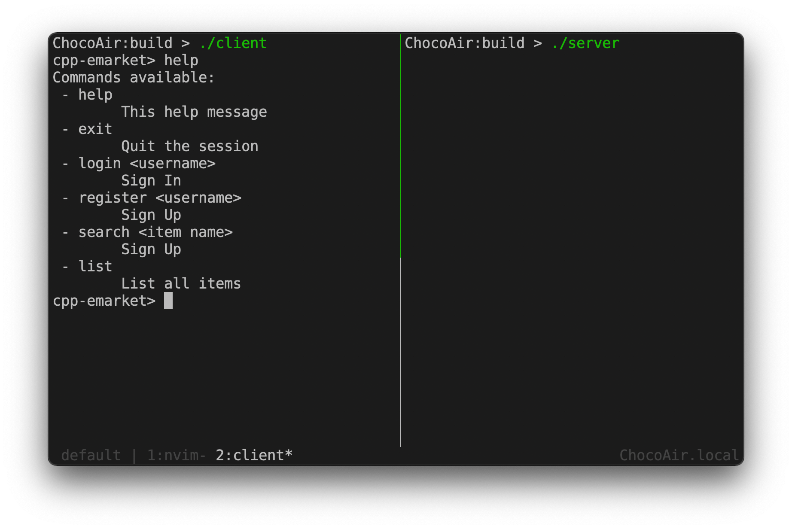
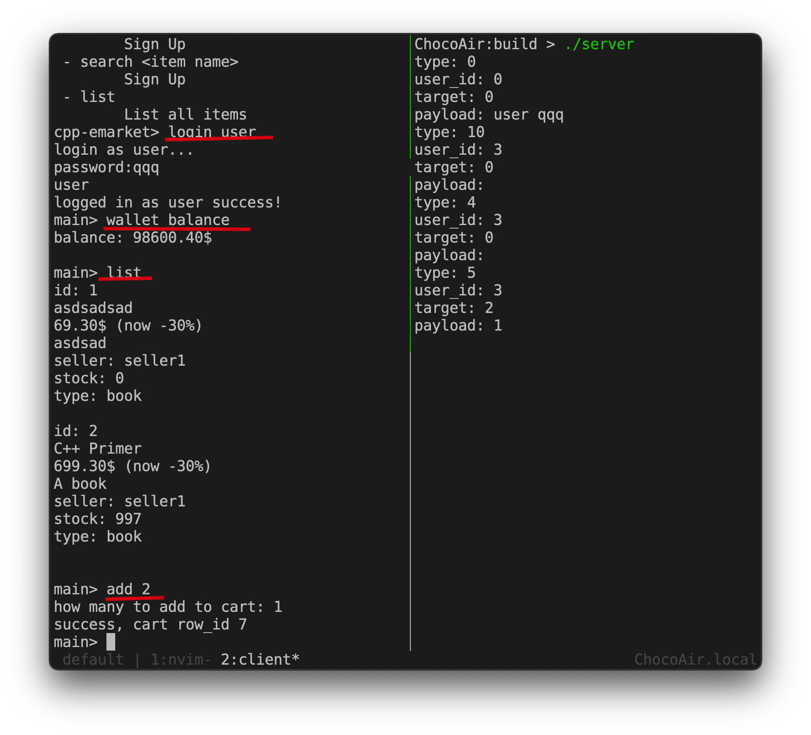
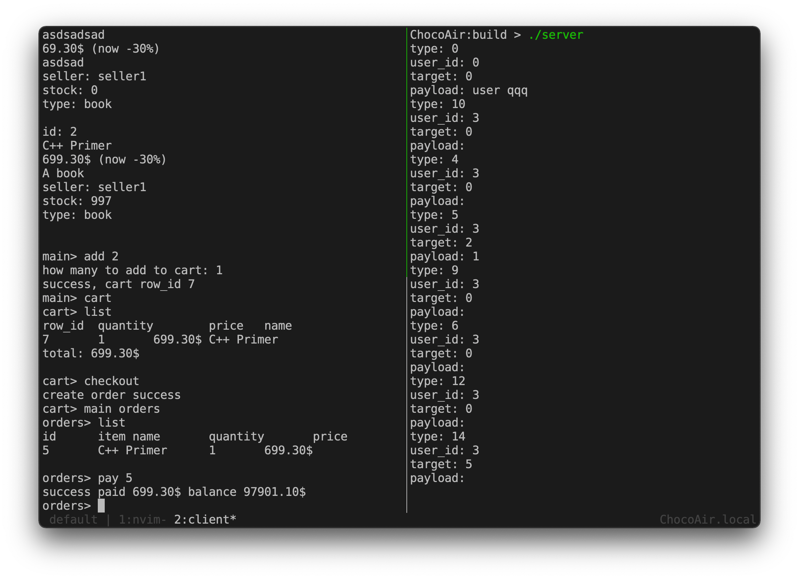

# 电商交易平台设计与实现 实验报告

## 程序设计

程序单机版与网络版统一设计, 分为完全解耦的前后端两部分. 前后端两部分可以联合
编译为单机版, 也可以加入socket部分分别编译为服务器和客户端.

### 文档生成

程序使用`Doxygen with dot`生成代码文档, 调用关系图, 模块关系图等.

使用方法, 在安装有doxygen与graphviz的电脑上运行以下命令:

```bash
$ cd doc
$ doxygen Doxyfile
$ open html/index.html
```

来编译并查看文档.

若不想自己生成, doc文件夹中有预生成版本

### 版本管理

项目使用git进行版本管理, 部分提交记录如下

<div align="center"></div>

### 项目构建

__项目仅能在Linux/Unix环境下编译!!__

项目依赖: `cmake sqlite3`

项目使用CMake构建. 编译命令:

```bash
$ mkdir build && cd build
$ cmake ..
$ make
```

### 程序结构

1. 单机版程序的结构如下:

 

首先前后端共用data_type模块, 其中定义了一些共用的数据结构与数据格式.

客户端负责三件事情:

- 接收用户输入

- 记录用户状态(是否登录等)

- 客户端在接收用户输入后, 调用private函数client_session::feed()向后端发起请求.

后端的session::exec(request_data) 接收用户发来的请求, 并返回response_data给
客户端的feed函数. feed函数拿到响应后再进行相应处理

2. 网络版程序的结构如下:



与单机版的区别如下:

- 客户端的feed函数不再自行调用服务器的session::exec()函数, 而是将请求喂给socket
  服务器端监听到accept请求后将请求转接给serve函数处理, serve函数负责从socket
  中读取request并将其交由exec函数处理

- exec函数处理完请求后serve函数负责将其返回值送回给socket.

- 服务器收到连接请求后会新创建一个线程来处理该请求. 代码如下

```cpp
  while (1) {
    auto sock = acc.accept();

    if (!sock) {
      std::cerr << "error accepting incoming connection: "
                << sock.last_error_str() << std::endl;
    } else {
      std::thread thr(serve, std::move(sock));
      thr.detach();
    }
  }
```

### 外部库使用

[sockpp: Simple, modern, C++ socket library.](https://github.com/fpagliughi/sockpp)

[cli: A cross-platform header only C++14 library for interactive command line interfaces (Cisco style)](https://github.com/daniele77/cli)

[sqlite_orm: SQLite ORM light header only library for modern C++](https://github.com/fnc12/sqlite_orm)

## 问题与解决方法

### 数据库数据存储格式需要统一与派生类需要实例化成不同的类型矛盾

我的解决方法是存储类`data_type::user_data`与处理类`my_user::base_user`分离.
user_data为数据库内部的存储类型与orm绑定的数据类型. base_user是负责对数据进行
处理, 是各用户类型的基类. 内含一个std::unique_ptr<user_data>数据类型.

base_user中有一个static方法get(user_id), 负责三件事:

- 首先从数据库中定位到user_id的用户, 将其用户信息取道user_data中

- 根据该用户的类型(商家/用户)实例化出来一个对应的派生类对象

- 返回一个base_user的unique_ptr, 以便我们调用虚函数时顺利进行动态绑定.

其他派生家族的处理方式类似

### socket传输不定长的std::string

首先一个模板函数足够处理各种定长数据格式的传送. 对于不定长的数据格式(比如
std::string)我们则需要实例化出特殊的版本.

普通的模板函数如下:

```cpp
template <typename T>
ssize_t base_data::write(sockpp::stream_socket &sock, const T &buf) {
  return sock.write(&buf, sizeof(T));
}

template <typename T>
ssize_t base_data::read(sockpp::stream_socket &sock, T &buf) {
  auto len = sock.read(&buf, sizeof(T));
  return len;
}
```

由于`sizeof(std::string)`并不能代表string的真实大小, 我们显式实例化模板参数为
std::string的版本如下


```cpp
template <>
ssize_t base_data::write(sockpp::stream_socket &sock, const std::string &buf) {
  ssize_t tot = 0;
  unsigned int len = buf.length();
  tot += sock.write(&len, sizeof(unsigned int));
  tot += sock.write(&buf[0], len);
  return tot;
}

template <>
ssize_t base_data::read(sockpp::stream_socket &sock, std::string &buf) {
  ssize_t tot = 0;
  unsigned int len;
  tot += read(sock, len);
  buf.resize(len);
  tot += sock.read(&buf[0], len);
  return tot;
}
```

实际上我们将std::string的传输拆分成两步:

- 首先传输该string的长度(`str.length()`)

- 之后读取时首先将容器resize为该长度然后读取.

## 程序使用说明

首先运行server与client

<div align="center"></div>

客户端在任意菜单键入`help`查看帮助

### 程序演示-购物

- 首先以user的身份登录
- 查询余额
- 查看商品
- 添加id为2的商品至购物车
- 展示购物车
- 购物车结算
- 订单展示
- 付款
``` 
login user
wallet balance
list
add 2
cart  # 从main切换至cart菜单
list
checkout
main orders # 从main->cart切换至main->orders菜单
list
pay 5 # 付款id为5的订单
```
<div align="center"></div>
<div align="center"></div>

## 数据结构/类定义等

参见代码文档 `./doc/html/index.html`
